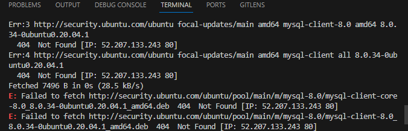

# Implement-a-client-server-architecture-using-MYSQL-database-management-system-DBMS

# How to create a database on mysql run
 CREATE USER 'mimi'@'172.31.29.157' identified by 'password'; (for the user to log in from a specific ip) or
CREATE USER 'Cheta'@'%' identified by 'Password'; (for the user to log in from anywhere)
 # How to give privileges to user run
 GRANT ALL PRIVILEGES ON *.* TO 'mimi'@'172.31.29.157'; or grant all privileges on mimi.* to Kamso

 # How to save changes on mysql
 FLUSH PRIVILEGES;

 # How to show databases
 select user, host FROM mysql.user;

 # How to log in from client to server
 First cd into /etc/mysql
 Then, run mysql -u mimi(username) -h 172.31.91.16(ip of the server) -p

 # How to see database created
 show databases;

 # ERROR
I encountered this error while installing the mysql services

Corretion- I run `sudo apt-get update` before installing mysql

