## This is how I demonstarted the client-server using MYSQL DATABASE MANAGEMENT SYSTEM (DBMS) 

1. I craeted 2 linux based virtual servers (EC2 instances in AWS) named mysql client and mysql server

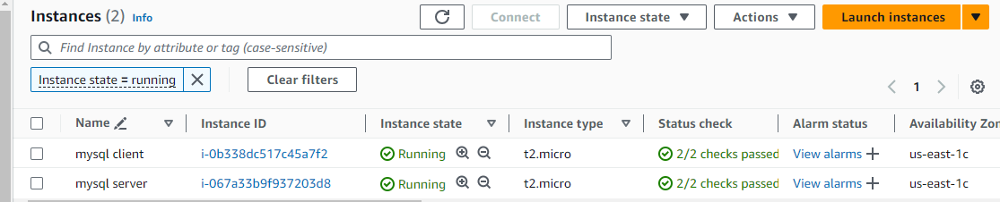

2. On mysql server I installed mysql server software by running `sudo apt-get update` first to update the service 
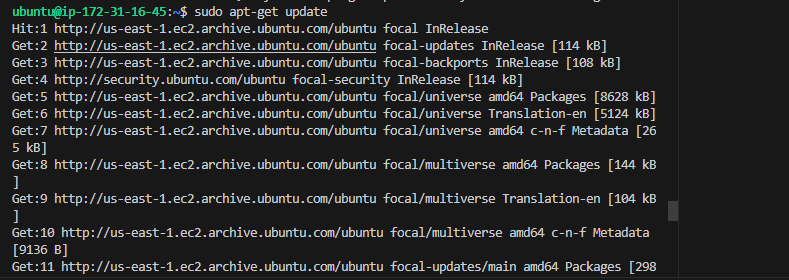

And finally run `sudo apt install mysql-server` to install the service

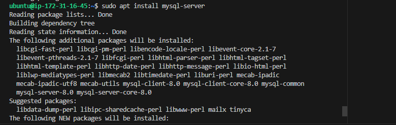
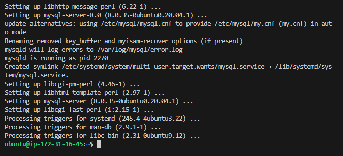

3. On mysql client I installed mysql client software by running `sudo apt-get update` first to update the service 
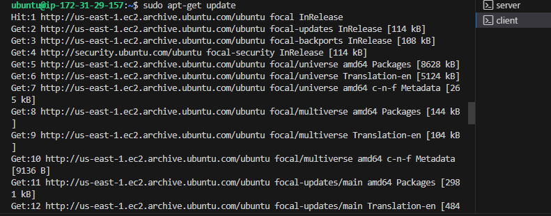

And finally run `sudo apt install mysql-client` to install the service

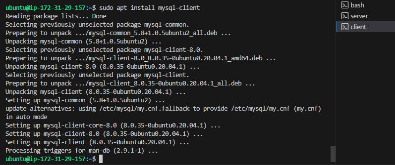

4. I created a new entry in the security group of mysql server to allow only mysql client to connect to the server by opening mysql/Aurora port 3306 and using the private ip address of the mysql client

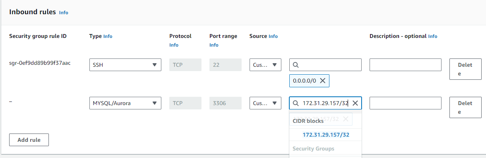

5. I run `sudo vi /etc/mysql/mysql.conf.d/mysql.cnf`to edit the configuration file in the mysql server by changing the bind address in the file from 127.0.0.1 to 0.0.0.0
Mote- The essence of this mysql server configuration is to allow connects from remote hosts

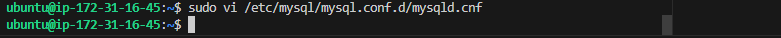
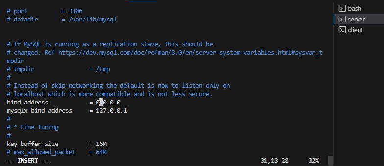

6. Firstly, I log into mysql console, created user and granted her privileges on mysql server using `sudo mysql`

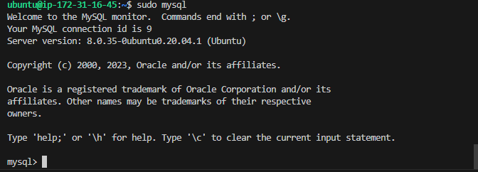

 `CREATE USER 'mimi'@'172.31.29.157' identified by 'password';` 
 `GRANT ALL PRIVILEGES ON *.* TO 'mimi'@'172.31.29.157';`

 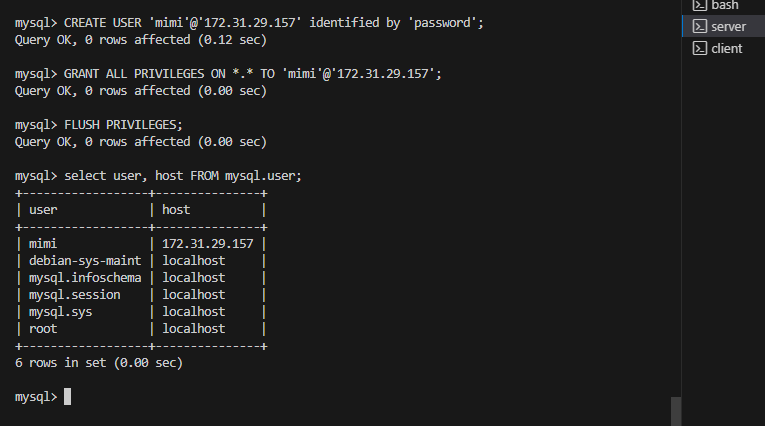

I connected remotely from the mysql client linux server to mysql database engine using mysql utility. I changed directory using `cd /etc/mysql` before running 
`mysql -u mimi -h 172.31.16.45 -p ` to connect to the server. And, to check that i have successfully conncted to a remote mysql server and can perform sql queries i run `show databases;` 

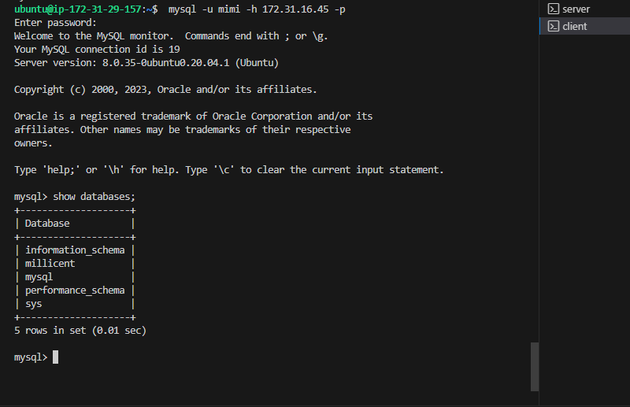

